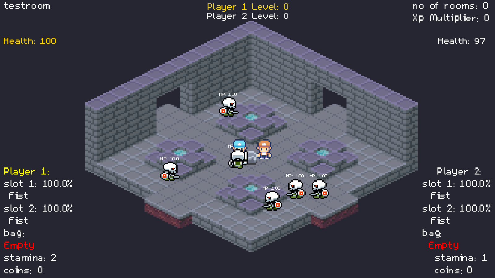
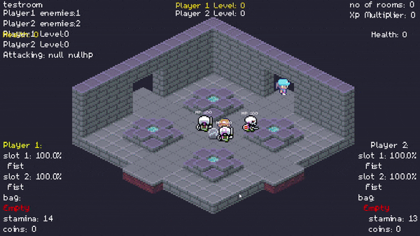
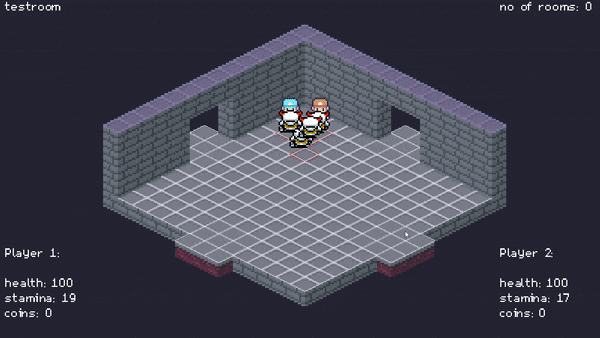

# mazegame

A [libGDX](https://libgdx.com/) project generated with [gdx-liftoff](https://github.com/tommyettinger/gdx-liftoff).

# A Screenshot during a run of the game 

# Traversing between rooms and combat debugging

# Pathfinding

